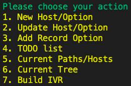
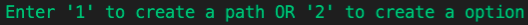
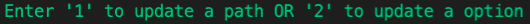
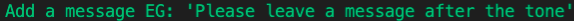
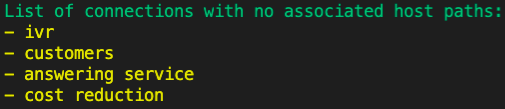
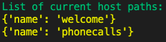
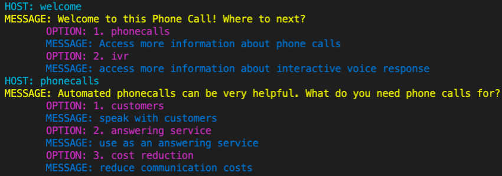
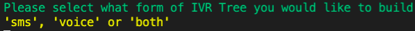
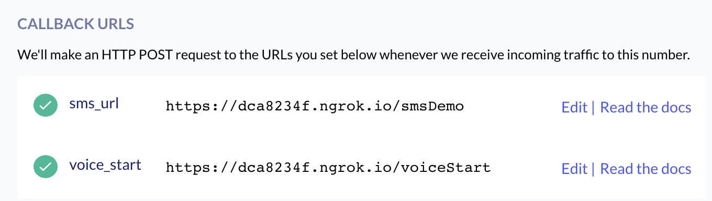

# ivrTreeCreator

### What you will need

* [A 46elks Account](www.46elks.com)
* A free [mongoDB Atlas account](https://www.mongodb.com/cloud/atlas)
* If you want to use Google's Text-to-speech API then you need a [GCP Account](https://cloud.google.com/text-to-speech)
* Currently the API and Demo Environment is served using the bottle.py microframework on an NGROK server
* If you want to use SMS the Konversations API is more stable (regular SMS integration coming)

* you will need to create a config.py file to store MongoDB and 46elks Credentials
```
mongo_user = 'USERNAME'
mongo_pass = 'PASSWORD'

elks_user = 'USERNAME'
elks_pass = 'PASSWORD'
```

## Overview

There are currently three components to this repo:

1. The Builder API
2. The Builder Tool
3. The Demo Environment

The **'Builder API'** communicates with MongoDB and Google when creating branches/IVR etc. The builder API also receives input from the Builder tool. 

The **'Builder Tool'** is a simple command line interface to add branches, messages and options to your IVR or SMS tree. Currently this only supports building new trees and adding options to branches. In the future more functionality such as editing current messages and options will be available. 

The **'Demo Environment'** is a server that will run so that calls and text messages can interact with the IVR / SMS trees you have built

### The Builder API

You will need to update:

```
db = client.get_database("YOUR DATABASE")
first = db.YOUR COLLECTION #usecase collection
currentServer = "https://dca8234f.ngrok.io/"
```

The 'Builder API' **must be running** whilst you are using the 'Builder Tool'

To start:
```
python3 BuilderAPI.py
```

### The Builder Tool

This is the tool that communicates with the API to build your IVR trees. 
The 'Builder API' **must be running** whilst you are using the 'Builder Tool'



1. New Host(s) contain Option(s) and serve as endpoints for other options.<br/> 
<br/> 
This will allow you to create new host branches, options and connections

2. Update Host/Option<br/>
<br/>
This will allow you to change the messages for hosts and options

3. Add Record Option<br/>
<br/>
This allows you to add a record action as an option. Implementing this option will append a URL to the customers call file where you can download the recorded audio.

4. TODO list is a list of hosts that need to be made to match with option connections<br/>
<br/>
This shows you a list of the hosts that need to be made so that when options are selected messages are returned.

5. Current Paths/Hosts refers to the available Paths/Hosts to add options to.<br/>
<br/>
This the the list of current hosts.

6. Returns a formatted view or raw JSON of your current IVR Tree<br/>
<br/>

7. Builds the Voice IVR system using Google Text-to-speech<br/>
<br/>
You will need to export your credentials correctly for this step to processes[guide on credentials](https://cloud.google.com/docs/authentication/getting-started)

### The Demo Environment

In order to test your current tree you will need to update:

```
db = client.get_database("YOUR DATABASE")
first = db.YOUR COLLECTION #usecase collection
currentServer = "https://dca8234f.ngrok.io/"
```

AND the call forwarding options on your 46elks account.

